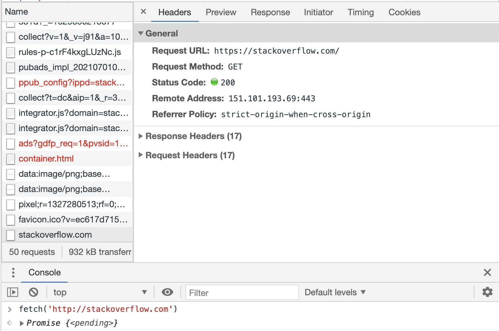

#### 1. В ответе укажите полученный HTTP код, что он означает?
`HTTP/1.1 301 Moved Permanently` (редирект)

#### 2. Повторите задание 1 в браузере, используя консоль разработчика F12.


#### 3. Какой IP адрес у вас в интернете?
```bash
# curl https://ipinfo.io/ip
178.205.151.221
```

#### 4. Какому провайдеру принадлежит ваш IP адрес? Какой автономной системе AS? Воспользуйтесь утилитой `whois`
```bash
# whois 178.205.151.221
Service Provider PJSC Tattelecom
AS28840
```

#### 5. Через какие сети проходит пакет, отправленный с вашего компьютера на адрес 8.8.8.8? Через какие AS? Воспользуйтесь утилитой `traceroute`
```bash
traceroute to 8.8.8.8 (8.8.8.8), 30 hops max, 60 byte packets
 1  10.0.2.2 [*]  0.128 ms  0.640 ms  0.626 ms
 2  192.168.1.1 [*]  42.530 ms  42.515 ms  42.501 ms
 3  10.16.255.133 [*]  41.739 ms  41.731 ms  41.721 ms
 4  10.16.248.125 [*]  42.348 ms 10.64.241.73 [*]  41.642 ms 10.16.248.141 [*]  41.742 ms
 5  10.16.248.150 [*]  41.964 ms 10.16.248.218 [*]  41.707 ms 10.16.248.206 [*]  42.052 ms
 6  10.16.248.130 [*]  42.084 ms 10.16.248.253 [*]  3.632 ms  4.306 ms
 7  87.245.231.206 [AS9002]  17.306 ms 188.170.164.138 [AS31133]  18.385 ms 87.245.231.206 [AS9002]  17.270 ms
 8  10.222.16.37 [*]  18.459 ms 87.245.234.56 [AS9002]  17.846 ms 10.222.16.33 [*]  26.193 ms
 9  10.222.177.158 [*]  28.391 ms  28.376 ms 72.14.222.22 [AS15169]  20.427 ms
10  10.222.99.61 [*]  19.684 ms  20.303 ms 108.170.250.146 [AS15169]  21.246 ms
11  83.169.204.117 [AS31133]  27.824 ms  27.806 ms 142.251.49.78 [AS15169]  35.769 ms
12  72.14.222.181 [AS15169]  25.216 ms 172.253.65.82 [AS15169]  36.924 ms 216.239.48.224 [AS15169]  28.983 ms
13  216.239.57.229 [AS15169]  39.357 ms 108.170.250.83 [AS15169]  17.911 ms 172.253.79.237 [AS15169]  32.422 ms
14  * * 172.253.66.116 [AS15169]  32.904 ms
15  * 172.253.65.159 [AS15169]  32.170 ms *
16  72.14.235.193 [AS15169]  34.691 ms 142.250.238.181 [AS15169]  36.808 ms *
17  * * 172.253.66.110 [AS15169]  38.949 ms
18  * * *
19  * * *
20  * * *
21  * * *
22  * 8.8.8.8 [AS15169]  43.688 ms *
```

#### 6. Повторите задание 5 в утилите `mtr`. На каком участке наибольшая задержка - delay?
На участке 10
```bash
Keys:  Help   Display mode   Restart statistics   Order of fields   quit
                                  Packets               Pings
 Host                           Loss%   Snt   Last   Avg  Best  Wrst StDev
 1. AS???    10.0.2.2            0.0%    41    0.2   0.3   0.1   0.5   0.1
 2. AS???    192.168.1.1         0.0%    41    3.2   3.0   2.0   9.3   1.5
 3. AS???    10.16.255.133       0.0%    40    3.1   7.0   2.4 112.0  17.9
 4. AS???    10.16.248.249       0.0%    40    3.3   5.8   2.6  71.2  10.8
 5. AS???    10.16.248.170       0.0%    40   12.8   7.6   2.8 131.4  20.6
 6. AS???    10.16.248.253       0.0%    40    3.6   6.1   3.0  90.5  13.8
 7. AS9002   87.245.231.206      0.0%    40   16.6  20.9  15.4 128.4  19.0
 8. AS9002   87.245.234.56       0.0%    40   15.8  21.8  15.8 101.4  17.8
 9. AS15169  72.14.222.22        0.0%    40   16.9  19.9  16.7  60.5   8.9
10. AS15169  108.170.250.99      0.0%    40   24.3  28.1  23.7 161.8  21.7
11. AS15169  172.253.66.116      2.5%    40   30.2  37.1  30.2 150.3  25.7
12. AS15169  72.14.235.69        0.0%    40   38.0  43.5  38.0 137.5  19.5
13. AS15169  142.250.56.221      0.0%    40   30.5  33.3  30.0  89.0  10.7
14. (waiting for reply)
15. (waiting for reply)
16. (waiting for reply)
17. (waiting for reply)
18. (waiting for reply)
19. (waiting for reply)
20. (waiting for reply)
21. (waiting for reply)
22. (waiting for reply)
23. (waiting for reply)24. (wai  0.0%    40   37.0  41.0  36.9 107.2  13.9
```

#### 7. Какие DNS сервера отвечают за доменное имя dns.google? Какие A записи? воспользуйтесь утилитой `dig`
```bash
# dig  @8.8.8.8 dns.google
;; ANSWER SECTION:
dns.google.		169	IN	A	8.8.4.4
dns.google.		169	IN	A	8.8.8.8
```
#### 8. Проверьте PTR записи для IP адресов из задания 7. Какое доменное имя привязано к IP? воспользуйтесь утилитой `dig`
```bash
# dig -x 8.8.4.4
;; ANSWER SECTION:
4.4.8.8.in-addr.arpa.	19875	IN	PTR	dns.google.

# dig -x 8.8.8.8
;; ANSWER SECTION:
8.8.8.8.in-addr.arpa.	6392	IN	PTR	dns.google.
```