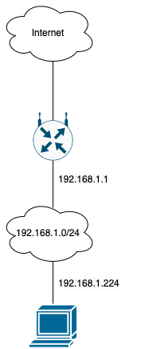

#### 1. Подключитесь к публичному маршрутизатору в интернет. Найдите маршрут к вашему публичному IP
done
```markdown
route-views>show ip route 46.243.201.233
Routing entry for 46.243.201.0/24
  Known via "bgp 6447", distance 20, metric 10
  Tag 3257, type external
  Last update from 89.149.178.10 1w2d ago
  Routing Descriptor Blocks:
  * 89.149.178.10, from 89.149.178.10, 1w2d ago
      Route metric is 10, traffic share count is 1
      AS Hops 3
      Route tag 3257
      MPLS label: none

route-views>show bgp 46.243.201.233
BGP routing table entry for 46.243.201.0/24, version 174563333
Paths: (24 available, best #24, table default)
  Not advertised to any peer
  Refresh Epoch 1
  20912 3257 12389 208677
    212.66.96.126 from 212.66.96.126 (212.66.96.126)
      Origin IGP, localpref 100, valid, external
      Community: 3257:4000 3257:8921 3257:50001 3257:50110 3257:54600 3257:54601 20912:65004
      path 7FE093228548 RPKI State valid
      rx pathid: 0, tx pathid: 0
  Refresh Epoch 1
  3561 3910 3356 12389 208677
    206.24.210.80 from 206.24.210.80 (206.24.210.80)
      Origin IGP, localpref 100, valid, external
      path 7FE0D6CC4828 RPKI State valid
      rx pathid: 0, tx pathid: 0
  Refresh Epoch 1
  3267 1299 12389 208677
    194.85.40.15 from 194.85.40.15 (185.141.126.1)
      Origin incomplete, metric 0, localpref 100, valid, external
      path 7FE1756884A8 RPKI State valid
      rx pathid: 0, tx pathid: 0
  Refresh Epoch 1
  3333 1103 12389 208677
    193.0.0.56 from 193.0.0.56 (193.0.0.56)
      Origin incomplete, localpref 100, valid, external
      path 7FE1755A7A68 RPKI State valid
      rx pathid: 0, tx pathid: 0
  Refresh Epoch 1
  3549 3356 12389 208677
    208.51.134.254 from 208.51.134.254 (67.16.168.191)
      Origin IGP, metric 0, localpref 100, valid, external
      Community: 3356:2 3356:22 3356:100 3356:123 3356:501 3356:901 3356:2065 3549:2581 3549:30840
      path 7FE102062D78 RPKI State valid
      rx pathid: 0, tx pathid: 0
  Refresh Epoch 1
  3356 12389 208677
    4.68.4.46 from 4.68.4.46 (4.69.184.201)
      Origin IGP, metric 0, localpref 100, valid, external
      Community: 3356:2 3356:22 3356:100 3356:123 3356:501 3356:901 3356:2065
      path 7FE1424FC478 RPKI State valid
      rx pathid: 0, tx pathid: 0
  Refresh Epoch 1
  53767 174 174 3356 12389 208677
    162.251.163.2 from 162.251.163.2 (162.251.162.3)
      Origin IGP, localpref 100, valid, external
```

#### 2. Создайте dummy0 интерфейс в Ubuntu. Добавьте несколько статических маршрутов. Проверьте таблицу маршрутизации.
Интерфейс создал. 
```bash
# ip -br l
lo               UNKNOWN        00:00:00:00:00:00 <LOOPBACK,UP,LOWER_UP>
eth0             UP             08:00:27:e3:90:c5 <BROADCAST,MULTICAST,UP,LOWER_UP>
dummy0           UNKNOWN        56:e8:f4:02:f2:13 <BROADCAST,NOARP,UP,LOWER_UP>


# ip route
default via 10.0.2.2 dev eth0 proto dhcp src 10.0.2.15 metric 100
10.0.2.0/24 dev eth0 proto kernel scope link src 10.0.2.15
10.0.2.2 dev eth0 proto dhcp scope link src 10.0.2.15 metric 100
```

#### 3. Проверьте открытые TCP порты в Ubuntu, какие протоколы и приложения используют эти порты? Приведите несколько примеров.
```bash
ss -tapn

# ssh, sunrpc

State      Recv-Q     Send-Q         Local Address:Port          Peer Address:Port      Process
LISTEN     0          4096                 0.0.0.0:111                0.0.0.0:*
LISTEN     0          4096           127.0.0.53%lo:53                 0.0.0.0:*
LISTEN     0          128                  0.0.0.0:22                 0.0.0.0:*
ESTAB      0          0                  10.0.2.15:22                10.0.2.2:58046
LISTEN     0          4096                    [::]:111                   [::]:*
LISTEN     0          128                     [::]:22                    [::]:*
```

#### 4. Проверьте используемые UDP сокеты в Ubuntu, какие протоколы и приложения используют эти порты?
```bash
ss -uap

# sunrpc

State          Recv-Q         Send-Q                    Local Address:Port                     Peer Address:Port         Process
UNCONN         0              0                         127.0.0.53%lo:domain                        0.0.0.0:*
UNCONN         0              0                        10.0.2.15%eth0:bootpc                        0.0.0.0:*
UNCONN         0              0                               0.0.0.0:sunrpc                        0.0.0.0:*
UNCONN         0              0                                  [::]:sunrpc                           [::]:*
```

#### 5. Используя diagrams.net, создайте L3 диаграмму вашей домашней сети или любой другой сети, с которой вы работали.

