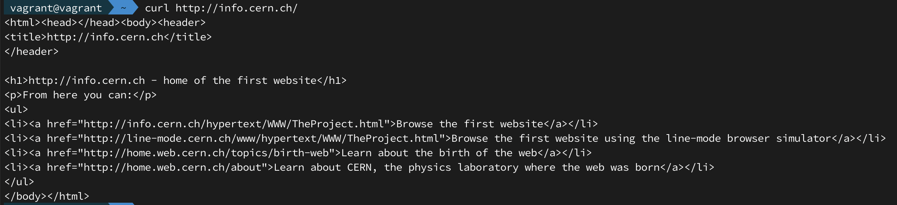
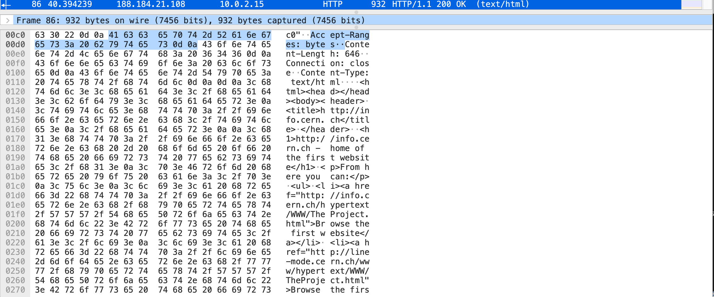

#### 1. Установите Bitwarden плагин для браузера. Зарегестрируйтесь и сохраните несколько паролей.
done

#### 2. Установите Google authenticator на мобильный телефон. Настройте вход в Bitwarden акаунт через Google authenticator OTP.
done

#### 3. Установите apache2, сгенерируйте самоподписанный сертификат, настройте тестовый сайт для работы по HTTPS.
*comments*

#### 4. Проверьте на TLS уязвимости произвольный сайт в интернете.
done

#### 5. Установите на Ubuntu ssh сервер, сгенерируйте новый приватный ключ. Скопируйте свой публичный ключ на другой сервер. Подключитесь к серверу по SSH-ключу.
*comments*

#### 6. Переименуйте файлы ключей из задания 5. Настройте файл конфигурации SSH клиента, так чтобы вход на удаленный сервер осуществлялся по имени сервера.
*comments*

#### 7. Соберите дамп трафика утилитой tcpdump в формате pcap, 100 пакетов. Откройте файл pcap в Wireshark.
Получилось подхватить html-контент 



 ---
### Задание для самостоятельной отработки (необязательно к выполнению)

#### 8*. Просканируйте хост scanme.nmap.org. Какие сервисы запущены?
```bash
nmap scanme.nmap.org

PORT      STATE SERVICE
22/tcp    open  ssh
53/tcp    open  domain
80/tcp    open  http
9929/tcp  open  nping-echo
31337/tcp open  Elite

```
#### 9*. Установите и настройте фаервол ufw на web-сервер из задания 3. Откройте доступ снаружи только к портам 22,80,443
*comments*
