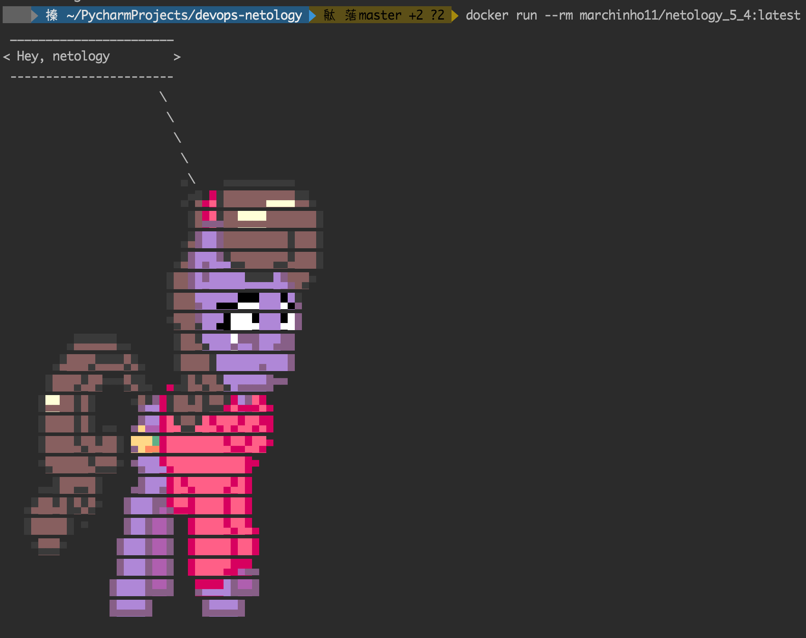
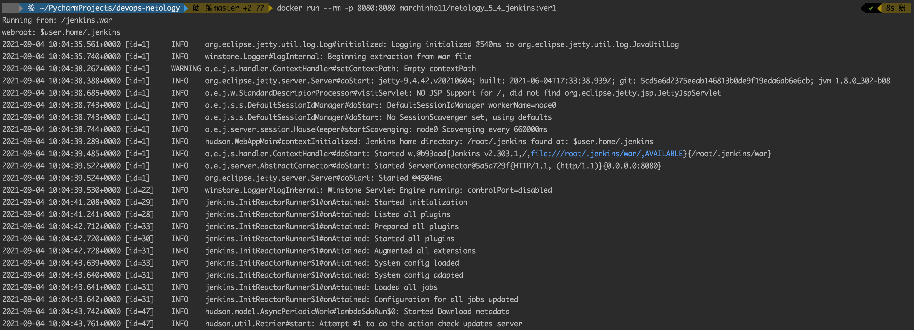
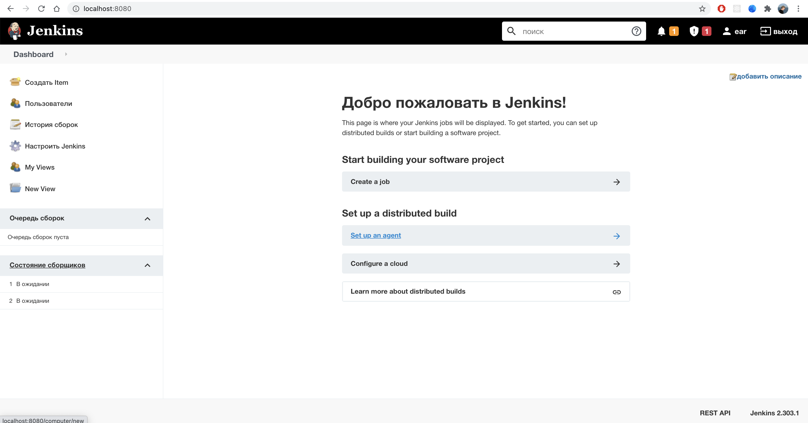
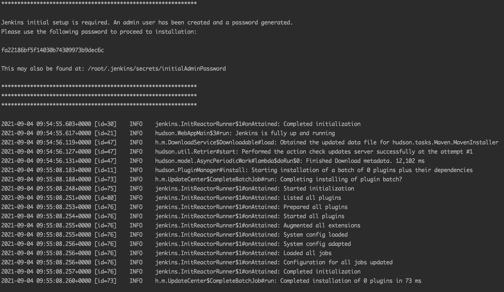
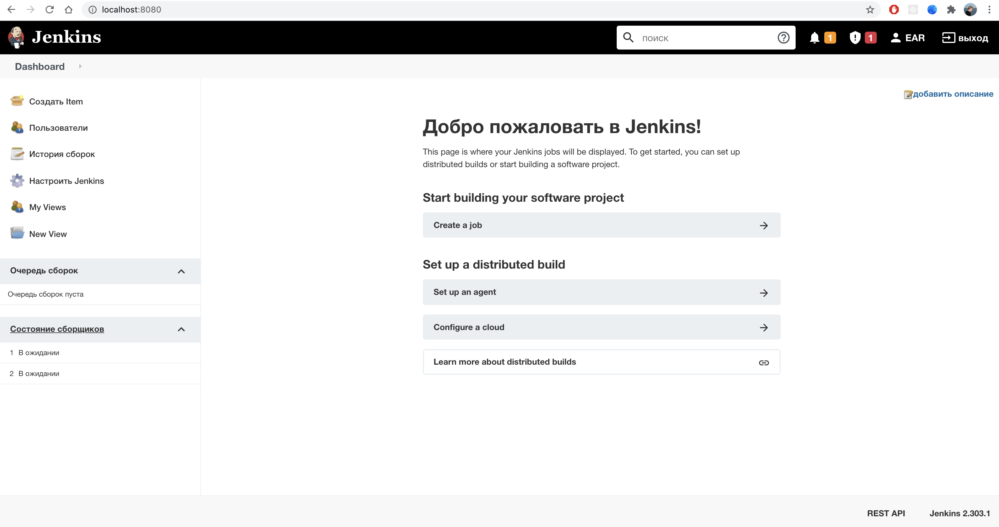
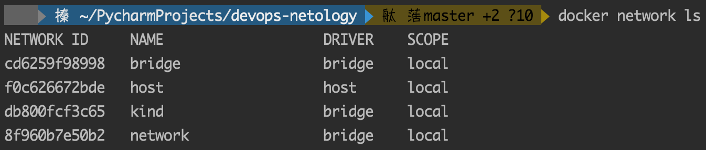
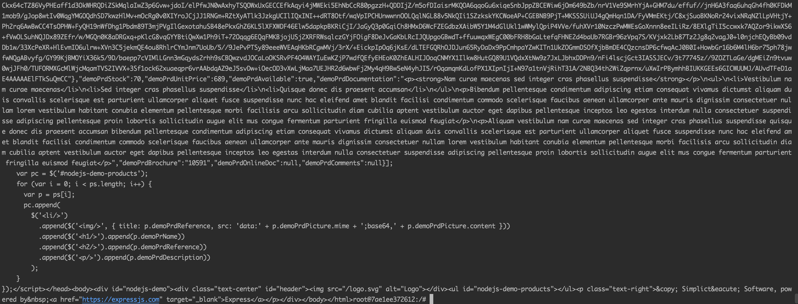

#### 1. В данном задании вы научитесь изменять существующие Dockerfile, адаптируя их под нужный инфраструктурный стек. Измените базовый образ предложенного Dockerfile на Arch Linux c сохранением его функциональности.

```dockerfile
FROM archlinux:latest

RUN pacman -Syy && \
    pacman -S --noconfirm ponysay

ENTRYPOINT ["/usr/bin/ponysay"]
CMD ["Hey, netology"]
```

https://hub.docker.com/r/marchinho11/netology_5_4



#### 2. В данной задаче вы составите несколько разных Dockerfile для проекта Jenkins, опубликуем образ в dockerhub.io и посмотрим логи этих контейнеров.

https://hub.docker.com/r/marchinho11/netology_5_4_jenkins

```dockerfile
# ver1
# docker run --rm -p 8080:8080 marchinho11/netology_5_4_jenkins:ver1
FROM amazoncorretto:8

RUN curl -LO https://get.jenkins.io/war-stable/2.303.1/jenkins.war

ENTRYPOINT ["java", "-jar", "jenkins.war"]
```

```dockerfile
# ver2
# docker run --rm -p 8080:8080 marchinho11/netology_5_4_jenkins:ver2
FROM ubuntu:latest

RUN apt update && \
    apt install -y wget openjdk-8-jdk

RUN wget https://get.jenkins.io/war-stable/2.303.1/jenkins.war

ENTRYPOINT ["java", "-jar", "jenkins.war"]
```
##### ver1



##### ver2



#### 3. В данном задании вы научитесь: объединять контейнеры в единую сеть, исполнять команды "изнутри" контейнера
```dockerfile
FROM node

RUN apt update && \
    apt install -y git

RUN git clone https://github.com/simplicitesoftware/nodejs-demo

ENV PORT=3000 VCAP_APP_HOST=0.0.0.0
EXPOSE 3000

WORKDIR /nodejs-demo
RUN npm install

ENTRYPOINT ["npm", "start"]
```

```shell
docker run -d --rm --name node-test -p 3000:3000 node-test
docker run -itd --name ubuntu ubuntu:latest

docker network create network
docker network connect network ubuntu
docker network connect network node-test

docker exec -it ubuntu bash
# curl http://node-test:3000
```
##### `docker netork ls`


##### `curl http://node-test:3000`

