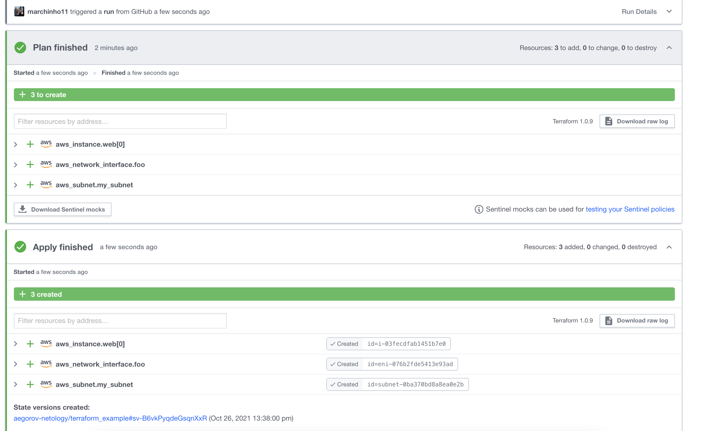

## Задание 1. Настроить terraform cloud
https://github.com/marchinho11/terraform_example

## Задание 2. Написать серверный конфиг для атлантиса.
https://github.com/marchinho11/devops-netology/tree/master/atlantis

## Задача 3. Знакомство с каталогом модулей.
https://github.com/marchinho11/devops-netology/tree/master/terraform/main.tf